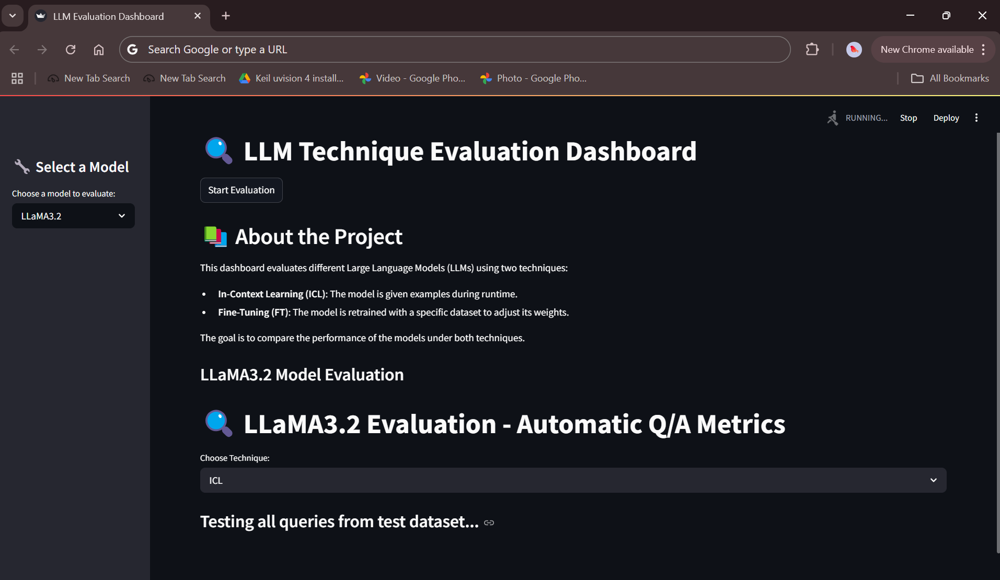

<<<<<<< HEAD
# Course Projects
### Overiew
Hi! I'm Pragna Ravi Kumar, A Master's student at Wayne State University. This repo contains certain personal projects, course projects in collaboration with my friends/teammates. 
Have a look at it and let us know what improvements can be done or just feel free to use it as a foundational model to build much more complex projects.
Thank you!

### Contents of repository
- *Pneumonia Detection System - As a part of Intelligent Analytics course. Collaborators - Sundari Sistla, Mihir Parekh, Sohail Siddiqui*
- *Fine-tuning v/s In-Context Learning: A comparative analysis on 3 different models based on Q/A NLP Task. Collaborators - Mihir Parekh, Arun Thangalapam*
- *AI Powered Research Assistant* 
=======
# Comparative Analysis of In-Context Learning and Fine-Tuning on *LLaMa 3.2, Gemma 2,* and *Mistral v1* for Question Answering
### Overiew

This project investigates two model adaptation techniques—**In-Context Learning (ICL)** and **Fine-Tuning (FT)**—applied to three Large Language Models: **LLaMA 3.2**, **Gemma 2**, and **Mistral v1**. The task is focused on **Question Answering (QA)** using a **Custom Dataset**.

A prototype web application is developed to demonstrate performance comparisons using a **Streamlit interface** and **Ollama** for local LLM deployment..

**This project is part of the course "Machine Learning"** 
**(Course Number: CSC 7825      Instructor: Dr. Prashant Khanduri)**

While this application is still under development, it can be extended by adding more models and try to compare the evaluation metrics across all the models used, and more, with necessary modifications depending on the requirements

### Contents of project
- *The datasets folder consists of the dataset used for both ICL and FT. It also contains a test dataset for testing purposes.*
- *The development folder consists of visualise.py file where we have attempted to create a script for evaluating metrics across the 3 models. However we're facing a little trouble as the both Gemma2 and Mistral v1 require more RAM space.*
- *The folder fine-tune-models consists of all the 3 models fine-tuned using PEFT loRa*
- *The jupyter notebook ML_finetuning.ipynb consists of Fine-tuning technique usinf PEFT LoRa Adapters.*
- *The files gemma2.py  llama3.py   mistral.py are the scripts for ICL technique and to run inference on the FT models*
- *The files gemma-finetune  llama3.2-finetune   mistral-finetune are the FT files converted to **gguf** format to run locally on Ollama.*
- *The main.py is the script written to run the Streamlit App.*

#### Command to run application

***CLI***
```bash
    streamlit run .\main.py
```  

### Instructions
- To run the models on Ollama please refer to the git repo -> **"https://github.com/ollama/ollama"**
- Always use a ***virtual environment*** to run the application
    **To create environment in conda use:**
    ```bash
        conda create --name yourenvname
    ```

    **Activate your env using:**
    ```bash
         conda activate yourenvname
    ```
        

### Results


*This is a screenshot of the prototype UI created to run the inference and the evaluation of each model on the two LLM adaptation techniques - In-Context Learning & Fine-Tuning.*
>>>>>>> adc525e (Added project files to new branch)
