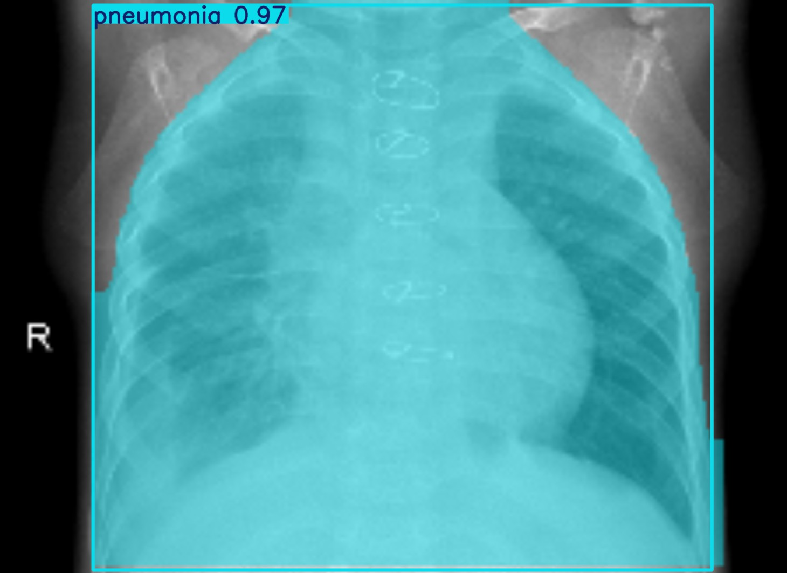

# Pneumonia Detection System
### Overiew
YOLO, or You Look Only Once, is a real-time object detection system in Computer Vision. It’s a deep learning algorithm that can detect and identify multiple objects in an image or video stream.

The main aim of this project is to provide users with an application to detect and analyze Chest X-ray images for signs of Pneumonia using YOLOv8.
This is presented in a **Streamlit Application** where a user can analyze X-ray images, videos, or real-time streams for Pneumonia detection.

**This project is part of the course "Intelligent Analytics"** 
**(Course Number: 7860-002      Instructor: Dr. Ratna Babu Chinnam)**

While this application is still under development, it can be extended for various medical imaging use cases, such as automatic disease diagnosis, radiology assistance, and more, with necessary modifications depending on the requirements

### Contents of project
- *The settings.py file is responsible for specifying paths necessary for the detection process.*
- *The helper.py file contains the code for detection of the objects when an image file is iploaded.*
- *Folder containting respective pages to navigate/link to the main page.*
- *A main page to navigate through the applications involved in the project.*

#### Command to run application

***CLI***
```bash
    streamlit run .\main.py
```  

### Instructions
- Settings for specifying file paths: settings.py
    -> **model:** model path 
- For every new model to be detected, change model_path in settings.py. Make sure   it     is in the ***same directory*** as the main python files are. The model is the ***.pt*** file obtained after training the model.
- Always use a ***virtual environment*** to run the application
    **To create environment in conda use:**
    ```bash
        conda create --name yourenvname
    ```

    **Activate your env using:**
    ```bash
         conda activate yourenvname
    ```
        

### Results


*This is detected image obtained after training the model.*