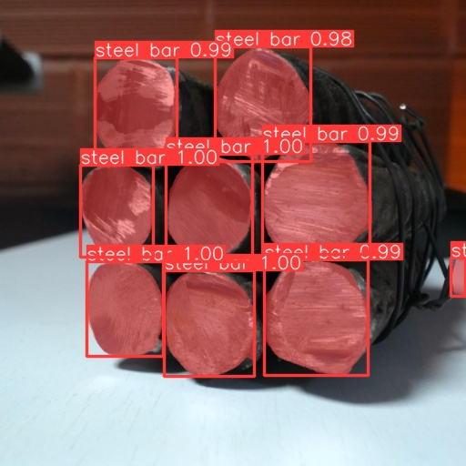

# Steel Bar Analysis
### Overiew
Yolo or You look only once is a real-time object detection system in **Computer Vision**. It's a deep learning algorithm that can **detect** and identify **multiple** objects in an image or video stream.
Our main aim of this project is to provide users an application to detect and segment *steel* or *iron* rods in videos or real-time.
This is presented in a **Streamlit Application** where a user can detect and segment *steel* or *iron* rods in videos or real-time
While this application is still in development stage, it can be used for various use cases including *Steel bar analysis, Fault/Rust prediction etc.* with the necessary modifications depending upon the use case.

### Contents of project
- *The settings.py file is responsible for specifying paths necessary for the detection/segmentation process.*
- *The helper.py file contains the code for detection/segmentation of the objects in a video or real-time.*
- *Folder containting respective pages to navigate/link to the main page.*
- *A main page to navigate through the applications involved in the project.*
- *A development folder where contributions towards improving the project can be made.* 

#### Command to run application

***CLI*** 
```bash
    streamlit run .\main.py
```


### Instructions
- Settings for specifying file paths: settings1.py
    -> **webcam:** webcam path
    -> **model:** model path 
- For every new model to be detected, change model_path in settings1.py. Make sure   it     is in the ***same directory*** as the main python files are. The model is the ***.pt*** file obtained after training the model.
- Always use a ***virtual environment*** to run the application
    **To create environment in conda use:**
    ```bash
        conda create --name yourenvname
    ```
        
    **Activate your env using:**
    ```bash
        conda activate 'yourenvname'
    ```
         

### Results



*This is detected image obtained after training the model.*